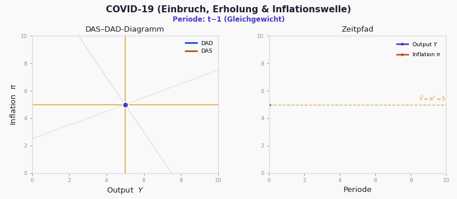
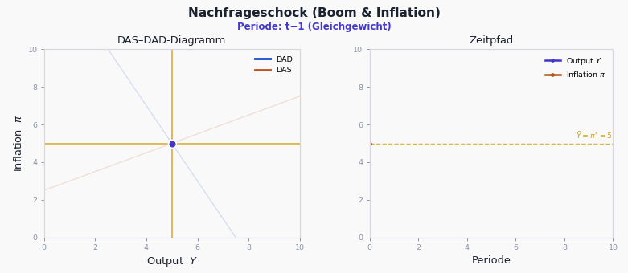
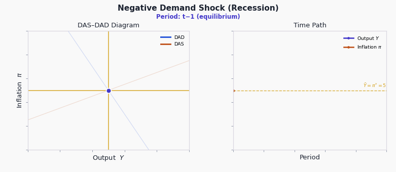
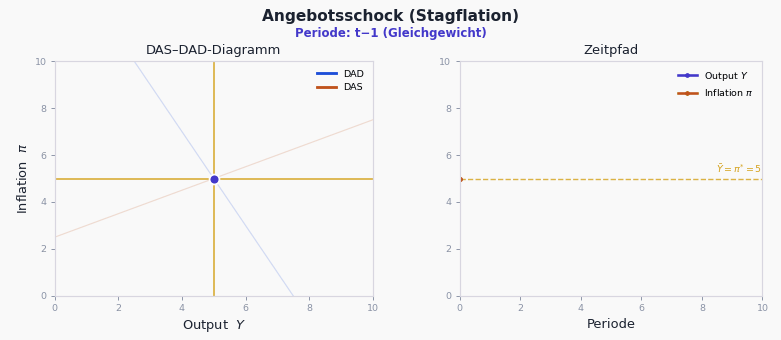
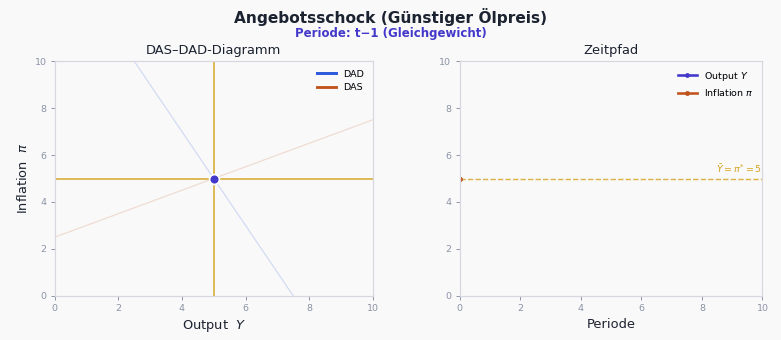
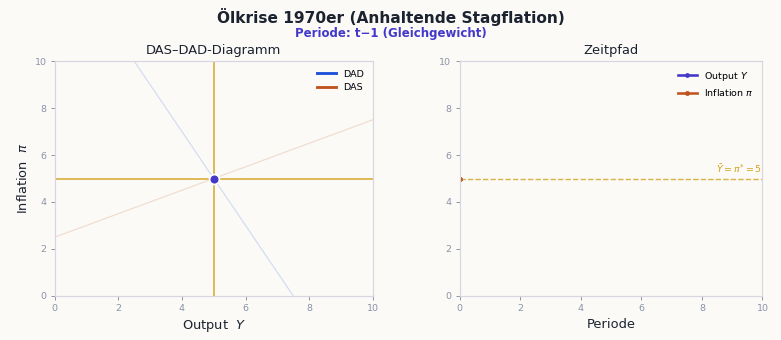
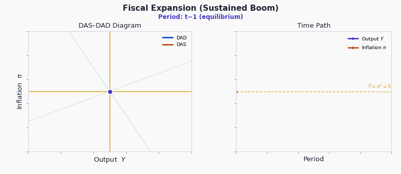
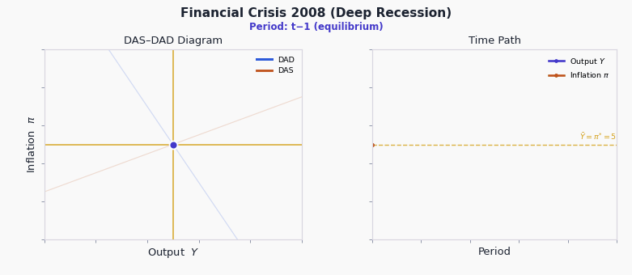

# Dynamic AD–AS Explorer

An interactive, browser-based teaching tool for the **Dynamic Model of Aggregate
Demand and Aggregate Supply (DAS–DAD)**, following Mankiw's *Macroeconomics*
(Ch. 15). Move the sliders, fire demand and supply shocks, and watch the economy
trace its way back to long-run equilibrium — both in the **DAS–DAD diagram** and
as **time paths** of output and inflation.

The whole thing is a single self-contained `index.html` (plus two stylesheets) —
no build step, no server required. Open the file and it runs.

> The interface is in German.

---

## See it in action

Each animation below shows the same two views you get in the app: the **DAS–DAD
diagram** on the left (the demand and supply curves shifting, with the
equilibrium walking back toward the centred Ȳ / π\* cross) and the **time paths**
of output `Y` and inflation `π` on the right.

### COVID-19 — collapse, recovery & inflation wave
A sharp demand collapse that lingers, followed by a supply-driven inflation wave.
Output drops, recovers to roughly three-quarters of the loss, then climbs
gradually back to potential — while inflation first dips, then surges, then eases.



### Positive demand shock — boom & inflation


### Negative demand shock — recession


### Adverse supply shock — stagflation
Inflation up, output down at the same time.



### Favourable supply shock — cheaper oil


### Oil crisis of the 1970s — persistent stagflation
A sequence of adverse supply shocks keeps inflation elevated for several periods.



### Fiscal expansion — sustained boom


### Financial crisis 2008 — deep recession
A deep, persistent demand collapse with a slow recovery.



---

## Features

- **English / German interface** — switch language from the dropdown on the
  start screen (the model is authored in German and rendered in English by
  default).
- **Interactive DAS–DAD diagram** built with Plotly. The equilibrium cross
  (Ȳ, π\*) always stays centred, and the window auto-fits so every period's
  equilibrium — and its π / Y labels — stay on screen.
- **Demand and supply shocks** at the impact period and up to four periods ahead
  (εₜ … εₜ₊₄ and νₜ … νₜ₊₄).
- **One-click scenarios** for the classic teaching cases (see the GIFs above),
  with the active scenario highlighted.
- **Animated adjustment** — step the economy forward period by period and watch
  it converge.
- **Two views**: the DAS–DAD diagram and the impulse-response time paths of
  output (in levels, starting from Ȳ) and inflation.
- **Adjustable structural parameters**: Ȳ, π\*, γ, φ, κ.
- **LaTeX-rendered equations** (MathJax) with click-to-reveal sliders.

---

## The model

The dynamics are driven by five equations (Mankiw, Ch. 15). In compact form:

**Dynamic aggregate demand (DAD):**

```
Y_t = Ȳ − γ (π_t − π*) + κ ε_t
```

**Dynamic aggregate supply (DAS), with adaptive expectations π_{t-1}:**

```
π_t = π_{t-1} + φ (Y_t − Ȳ) + ν_t
```

Substituting DAD into DAS gives the inflation law of motion that the tool
iterates:

```
π_t = a · π_{t-1} + (1 − a) π*  +  c_e ε_t  +  c_v ν_t
       a   = 1 / (1 + φγ)         (the decay / persistence factor)
       c_e = φκ / (1 + φγ)
       c_v = 1 / (1 + φγ)
```

and then `Y_t = Ȳ − γ (π_t − π*) + κ ε_t`.

| Symbol | Meaning                              | Default |
|:------:|--------------------------------------|:-------:|
| `Ȳ`    | Natural / potential output           | 5       |
| `π*`   | Central bank's inflation target      | 5       |
| `γ`    | Sensitivity of output to real rate   | 0.5     |
| `φ`    | Slope of the Phillips/DAS curve      | 0.5     |
| `κ`    | Output impact of a demand shock      | 0.7     |
| `ε_t`  | Demand shock                         | 0       |
| `ν_t`  | Supply shock                         | 0       |

With the defaults the persistence factor is `a = 1/(1+0.25) = 0.8`, so shocks
decay by 20% per period and the economy returns smoothly to (Ȳ, π\*).

### A note on the dynamics (worth knowing for teaching)

In this model a **temporary demand shock** has a subtle property: because
inflation has inertia, the economy can pass *through* potential on the way back
(when inflation is below target, the implied policy stance is loose, which lifts
output above Ȳ for a while). That is why the **COVID-19** scenario uses a demand
collapse that *lingers* (a smaller second-period drag) together with a single
positive supply shock — this reproduces the realistic picture of a deep drop, a
partial (~70–75%) recovery, and then a gradual climb back to potential **without**
an artificial overshoot, while still generating the later inflation wave. A
**supply-driven** inflation surge necessarily pushes output the other way
(stagflation), so the inflation wave here is deliberately modest to keep the
output recovery monotone; you can always dial the supply shocks up live to see
the stagflationary trade-off.

---

## Running it

It's a static site — pick whichever is easiest:

**Just open it.** Double-click `index.html`. (Most things work from `file://`;
a couple of browsers are stricter about loading the local stylesheets, in which
case use one of the options below.)

**Local web server:**

```bash
# from the project folder
python3 -m http.server 8000
# then visit http://localhost:8000
```

**GitHub Pages:** push the repository, then in *Settings → Pages* choose the
`main` branch / root. Your site will be served at
`https://<user>.github.io/<repo>/`. Because the entry point is `index.html`, no
extra configuration is needed.

---

## Project layout

```
dynamic-ad-as-explorer/
├── index.html          # the entire application (HTML + JS, boots the model)
├── styles/
│   ├── core.css         # base layout & components
│   └── theme.css         # colour theme / appearance layer (loaded last)
├── images/              # small UI icons
├── cover.png            # start-screen image
├── media/               # the scenario GIFs shown above
└── README.md
```

The GIFs are produced by a small, self-contained Python script
(`make_gifs.py`, included at the repository root) that re-implements the exact
model and renders each scenario with Matplotlib. To regenerate them:

```bash
pip install matplotlib pillow numpy
python3 make_gifs.py     # writes dynamic-ad-as-explorer/media/*.gif
```

### Make your own GIF for a talk or slide

`make_gifs.py` also exposes a one-call helper, `custom_gif(...)`, so you can drop
a tailored shock into a GIF in a few lines. Set `gamma`, `phi`, the shock
period(s) and size(s), and a title — everything you leave out keeps the model's
default:

```python
from make_gifs import custom_gif

custom_gif(
    gamma=0.5,            # how hard policy/demand leans against inflation
    phi=0.5,              # slope of the Phillips curve
    demand={1: 4},        # period -> demand-shock size  (period 1 == t)
    supply={3: 2},        # period -> supply-shock size
    title="My custom shock",
    out="media/my_shock.gif",
)
```

`demand` and `supply` are dictionaries mapping a shock **period** to a shock
**size** (positive or negative). Use one entry for a one-off shock, or several
periods for a drawn-out one — e.g. `demand={1: 4, 2: 2, 3: 2}` for a sustained
boom. The call writes the GIF to `out` and returns its path. **Alternatively** 
you can just click on the GIF button within the tool. However, visuals here 
are worse as a GIF direclty on Plotly within HTML somehow squeezes the GIF, so
for proper visualization use the Python command as explained.

---

## Built with

- [Plotly.js](https://plotly.com/javascript/) — interactive charts
- [MathJax](https://www.mathjax.org/) — LaTeX equation rendering
- Vanilla HTML / CSS / JavaScript — no framework, no build step

---

## References

- Mankiw, N. G. *Macroeconomics* — *A Dynamic Model of Aggregate Demand and
  Aggregate Supply* (Ch. 15).
- Phillips, A. W. (1958). "The Relation between Unemployment and the Rate of
  Change of Money Wage Rates." *Economica*.
- Friedman, M. (1968). "The Role of Monetary Policy." *American Economic Review*.
- Taylor, J. B. (1993). "Discretion versus Policy Rules in Practice."
- Clarida, Galí & Gertler (1999). "The Science of Monetary Policy."
- Galí, J. (2015). *Monetary Policy, Inflation, and the Business Cycle*.
- Woodford, M. (2003). *Interest and Prices*.
- Romer, D. (2000). "Keynesian Macroeconomics without the LM Curve."

---

## License & credits

The model and interactive tool are an educational implementation of the textbook
DAS–DAD framework. Original interactive tool by **Lucas Simon & Juri Ezzaini**;
UI icons from [flaticon.com](https://www.flaticon.com), imagery from
[pixabay.com](https://pixabay.com). Please add a `LICENSE` file (e.g. MIT) before
publishing if you intend others to reuse the code.
